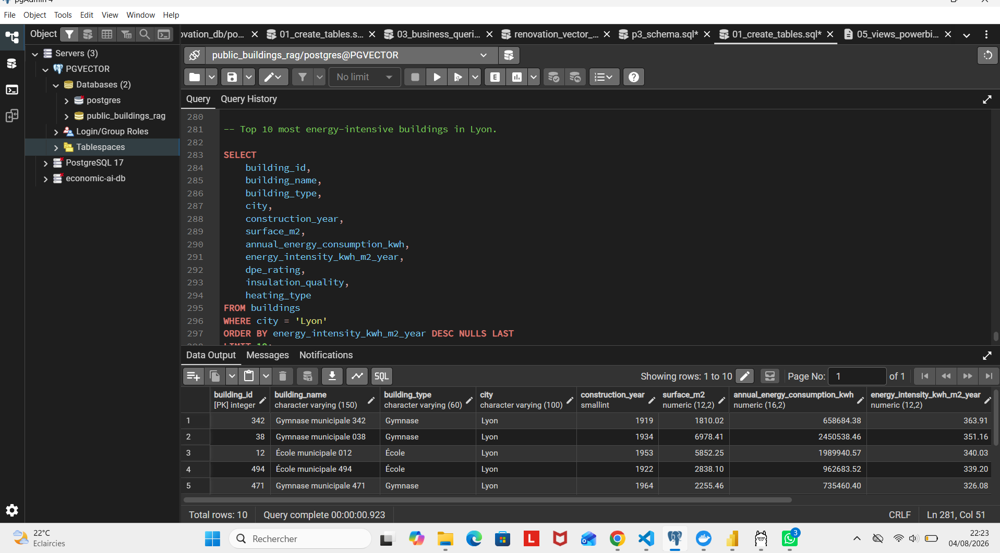

# 🏢 Public Buildings RAG — Local AI Assistant with PostgreSQL & pgvector

## 📌 Overview

**Public Buildings RAG** is an end-to-end **Retrieval-Augmented Generation (RAG)** application designed to explore and analyze public building and renovation data using natural language.

Instead of relying only on traditional SQL queries, the application allows users to ask questions such as:

> *Which buildings in Lyon are the most energy-intensive?*

> *Which insulation projects achieved good energy savings?*

> *Which renovation projects are the most relevant to my question?*

The application converts the user's question into a vector embedding, searches for semantically similar information in **PostgreSQL using pgvector**, and provides the retrieved context to **Llama 3.1**, running locally through **Ollama**, to generate a contextual answer.

The entire AI pipeline runs **locally**, without requiring a cloud-based LLM API.

---

## 🎯 Project Objective

Public building datasets contain useful information about:

- energy consumption;
- building characteristics;
- insulation quality;
- renovation projects;
- project costs;
- energy savings;
- project status;
- construction year;
- heating systems.

Traditional SQL is excellent when the user knows exactly what columns and filters to use.

For example:

```sql
SELECT *
FROM buildings
WHERE city = 'Lyon'
ORDER BY energy_intensity_kwh_m2_year DESC
LIMIT 10;
```

But business users do not necessarily think in SQL.

They ask questions such as:

> **"Which buildings in Lyon seem energy-intensive?"**

This project explores how **semantic search and Generative AI** can provide a more intuitive way to interact with structured and textual data.

---

# 🧠 What is RAG?

**RAG** stands for **Retrieval-Augmented Generation**.

The principle is simple:

1. The user asks a question.
2. The question is converted into a numerical vector called an **embedding**.
3. PostgreSQL searches for documents with similar vectors.
4. The most relevant documents are retrieved.
5. These documents are added to the LLM prompt as context.
6. Llama 3.1 generates an answer based on this retrieved context.

In simplified form:

```text
User Question
      │
      ▼
Embedding Model
nomic-embed-text
      │
      ▼
Question Vector
      │
      ▼
PostgreSQL + pgvector
      │
      ▼
Semantic Search
      │
      ▼
Relevant Documents
      │
      ▼
Prompt Construction
      │
      ▼
Llama 3.1
      │
      ▼
Generated Answer
      │
      ▼
Streamlit Interface
```

---

# 🏗️ Architecture

The project combines several components, each with a specific responsibility.

```text
                    ┌─────────────────────┐
                    │       USER          │
                    └──────────┬──────────┘
                               │
                         Natural language
                               │
                               ▼
                    ┌─────────────────────┐
                    │     STREAMLIT       │
                    │    Web Interface    │
                    └──────────┬──────────┘
                               │
                               ▼
                    ┌─────────────────────┐
                    │       PYTHON        │
                    │    RAG Pipeline     │
                    └──────────┬──────────┘
                               │
                 ┌─────────────┴─────────────┐
                 │                           │
                 ▼                           ▼
       ┌──────────────────┐        ┌──────────────────┐
       │      OLLAMA      │        │    POSTGRESQL    │
       │                  │        │    + pgvector    │
       │ nomic-embed-text │        │                  │
       └────────┬─────────┘        └────────┬─────────┘
                │                           │
                │ Embedding                │ Vector search
                └─────────────┬─────────────┘
                              │
                              ▼
                    Relevant documents
                              │
                              ▼
                    ┌─────────────────────┐
                    │     LLAMA 3.1       │
                    │ Answer Generation   │
                    └──────────┬──────────┘
                               │
                               ▼
                    ┌─────────────────────┐
                    │     STREAMLIT       │
                    │   Final Response    │
                    └─────────────────────┘
```

---

# 🛠️ Tech Stack

| Technology | Role |
|---|---|
| **Python** | Data processing and RAG orchestration |
| **PostgreSQL 17** | Relational database |
| **pgvector** | Vector storage and similarity search |
| **Docker** | Reproducible PostgreSQL + pgvector environment |
| **Ollama** | Local model execution |
| **Llama 3.1** | Generative language model |
| **nomic-embed-text** | Text embedding generation |
| **Streamlit** | Interactive web application |
| **psycopg** | Python/PostgreSQL communication |
| **VS Code** | Development environment |

---

# 🗄️ Data Model

The project is based mainly on two business entities.

## `buildings`

Contains information about public buildings, including:

- building ID;
- building name;
- building type;
- city;
- construction year;
- surface area;
- annual energy consumption;
- energy intensity;
- DPE rating;
- insulation quality;
- heating type.

Example business question:

> **Which buildings in Lyon are the most energy-intensive?**

---

## `renovation_projects`

Contains renovation project information such as:

- project ID;
- associated building;
- renovation type;
- project status;
- priority;
- estimated cost;
- actual cost;
- planned dates;
- energy savings.

Example:

> **Which insulation projects achieved the best energy savings?**

---

## `building_documents`

This table is particularly important for the RAG system.

It contains textual representations of the business data and their associated embeddings.

Conceptually:

```text
building_documents
│
├── document_id
├── building_id
├── project_id
├── document_type
├── title
├── content
├── metadata
├── embedding
└── created_at
```

The `embedding` column uses the **pgvector `vector` type**.

This allows PostgreSQL to perform mathematical similarity searches between the user's question and stored documents.

---

# 🔢 Embeddings

An embedding is a numerical representation of text.

For example:

```text
"Thermal insulation project in Lyon"
```

is transformed by the embedding model into something conceptually similar to:

```text
[0.021, -0.145, 0.087, ..., 0.034]
```

In this project, embeddings are generated using:

```text
nomic-embed-text
```

through Ollama.

The generated vectors contain:

```text
768 dimensions
```

The project currently contains:

```text
1,400 vectorized documents
```

These vectors are stored directly inside PostgreSQL.

---

# 🔎 Semantic Search with pgvector

Traditional SQL searches for exact conditions.

For example:

```sql
WHERE city = 'Lyon'
```

Semantic search solves a different problem.

Suppose the user asks:

```text
Which insulation projects achieved good energy savings?
```

The application first generates an embedding for this question.

pgvector can then compare that vector with the embeddings stored in `building_documents`.

A cosine-distance search can use:

```sql
embedding <=> query_embedding
```

The closest documents are returned first.

Conceptually:

```sql
SELECT
    document_id,
    title,
    content,
    1 - (embedding <=> query_vector) AS similarity
FROM building_documents
ORDER BY embedding <=> query_vector
LIMIT 8;
```

This means the application does not search only for identical words.

It searches for **semantic similarity**.

---

# 🔄 RAG Pipeline

The complete pipeline can be summarized in six steps.

### 1 — User question

The user enters a natural-language question in Streamlit.

```text
Which insulation projects achieved good energy savings?
```

### 2 — Question embedding

Python sends the question to:

```text
nomic-embed-text
```

The model returns a 768-dimensional vector.

### 3 — Vector search

The vector is sent to PostgreSQL.

pgvector compares it with the vectors stored in `building_documents`.

### 4 — Retrieval

The most relevant documents are retrieved.

For example:

```text
Project 12 — Thermal insulation
Project 347 — Thermal insulation
Project 652 — Thermal insulation
...
```

### 5 — Prompt construction

The retrieved documents are combined with the user's question.

Conceptually:

```text
QUESTION:
Which insulation projects achieved good energy savings?

CONTEXT:
Document 1...
Document 2...
Document 3...

INSTRUCTION:
Answer using the provided context.
```

### 6 — Generation

The final prompt is sent to:

```text
Llama 3.1
```

The generated response is displayed in Streamlit.

---

# 📂 Project Structure

```text
public_buildings_rag/
│
├── data/
│   ├── buildings.csv
│   └── renovation_projects.csv
│
├── postgres/
│   └── 01_create_tables.sql
│
├── powerbi/
│
├── python/
│   ├── config.py
│   ├── generate_documents.py
│   ├── generate_embeddings.py
│   ├── load_data.py
│   ├── llm.py
│   ├── prompt_builder.py
│   ├── rag_cli.py
│   ├── rag_engine.py
│   ├── retriever.py
│   └── test_vector_search.py
│
├── sql/
│
├── streamlit/
│   └── app.py
│
├── .env.example
├── docker-compose.yml
├── requirements.txt
└── README.md
```

---

# 📄 Main Files Explained

## `docker-compose.yml`


## 🐳 Why Docker?

pgvector is a PostgreSQL extension...


Creates the PostgreSQL environment containing pgvector.

Docker makes the database environment reproducible without requiring a manual pgvector installation on the host machine.

---

## `postgres/01_create_tables.sql`

Initializes the PostgreSQL database.

It contains the SQL required to create the project's tables and pgvector-related structures.

---

## `python/config.py`

Centralizes configuration used by the Python application.

Typical configuration includes:

- PostgreSQL connection;
- Ollama host;
- embedding model;
- LLM model;
- RAG parameters.

---

## `python/load_data.py`

Loads the source datasets into PostgreSQL.

```text
CSV
 │
 ▼
Python
 │
 ▼
PostgreSQL
```

---

## `python/generate_documents.py`

Transforms structured database information into textual documents suitable for semantic search.

For example, structured information about a renovation project can become a document such as:

```text
Renovation project 12 concerns a public building in Lyon.
The renovation type is thermal insulation...
```

This textual representation makes the information easier to retrieve using embeddings.

---

## `python/generate_embeddings.py`

Generates vector embeddings for the documents using:

```text
nomic-embed-text
```

and stores them in PostgreSQL through pgvector.

---

## `python/retriever.py`


This is one of the core components of the RAG architecture.

Its responsibility is to:

1. receive the user's question;
2. generate the question embedding;
3. query PostgreSQL;
4. calculate vector similarity;
5. retrieve the most relevant documents.

In other words:

```text
Question
   ↓
Embedding
   ↓
pgvector
   ↓
Top relevant documents
```

---

## `python/prompt_builder.py`

Builds the final prompt sent to the language model.

It combines:

```text
User question
+
Retrieved context
+
Instructions
```

---

## `python/llm.py`

Handles communication with the local LLM through Ollama.

The main generation model is:

```text
Llama 3.1
```

---

## `python/rag_engine.py`

Orchestrates the complete RAG workflow.

Conceptually:

```python
question
   ↓
retriever
   ↓
documents
   ↓
prompt_builder
   ↓
llm
   ↓
answer
```

---

## `python/test_vector_search.py`

Allows vector search to be tested independently of the complete Streamlit application.

Example:

```powershell
python python\test_vector_search.py "Which insulation projects achieved good energy savings?"
```

This is useful for validating the retrieval layer before involving the LLM.

---

## `python/rag_cli.py`

Provides a command-line interface for testing the complete RAG pipeline without Streamlit.

This helps separate backend testing from frontend testing.

---

## `streamlit/app.py`

Provides the user-facing web interface.

It allows users to enter questions and interact with the RAG system without writing SQL or Python code.

---

# 🐳 Why Docker?

pgvector is a PostgreSQL extension.

Installing it directly on Windows can require additional configuration and compiled extension files.

Docker provides a simpler and reproducible environment using a PostgreSQL image with pgvector already available.

The database container exposes PostgreSQL to the host machine.

In this project:

```text
Windows / Python / pgAdmin
            │
            │ localhost:5433
            ▼
      Docker Container
            │
            ▼
     PostgreSQL :5432
            +
         pgvector
```

---

# 🚀 Installation

## Prerequisites

Make sure the following tools are installed:

- Docker Desktop
- Python
- Ollama
- Git

---

## 1. Clone the repository

```bash
git clone <YOUR_REPOSITORY_URL>
cd public_buildings_rag
```

---

## 2. Create the Python environment

On Windows:

```powershell
python -m venv .venv
.venv\Scripts\Activate.ps1
```

Install dependencies:

```powershell
pip install -r requirements.txt
```

---

## 3. Start PostgreSQL + pgvector

```powershell
docker compose up -d
```

Verify:

```powershell
docker ps
```

The PostgreSQL container should be running.

---

## 4. Install the Ollama models

```powershell
ollama pull llama3.1
```

```powershell
ollama pull nomic-embed-text
```

Verify:

```powershell
ollama list
```

---

## 5. Configure environment variables

Create a `.env` file from:

```text
.env.example
```

Configure your local PostgreSQL and Ollama settings.

> ⚠️ Never commit your real `.env` file or database passwords to GitHub.

---

## 6. Initialize the database

Create the PostgreSQL tables using:

```text
postgres/01_create_tables.sql
```

The pgvector extension must be enabled:

```sql
CREATE EXTENSION IF NOT EXISTS vector;
```

---

## 7. Load the datasets

```powershell
python python\load_data.py
```

---

## 8. Generate documents

```powershell
python python\generate_documents.py
```

---

## 9. Generate embeddings

```powershell
python python\generate_embeddings.py
```

This step converts the documents into vectors and stores them in PostgreSQL.

---

## 10. Test vector search

```powershell
python python\test_vector_search.py "Which buildings in Lyon are energy-intensive?"
```

---

## 11. Run the RAG application

```powershell
streamlit run streamlit\app.py
```

Then open the local Streamlit URL displayed in the terminal.

---

# 🧪 Example Questions

The assistant can be tested with questions such as:

```text
Which buildings in Lyon are the most energy-intensive?

Which insulation projects achieved good energy savings?

Which renovation projects should be prioritized?

What buildings have poor energy performance?

Which projects exceeded their estimated budget?
```

---

# 💡 SQL vs Semantic Search




One important aspect of this project is understanding that **SQL and vector search solve complementary problems**.

### SQL

Best for precise analytical questions:

```sql
SELECT building_name,
       energy_intensity_kwh_m2_year
FROM buildings
WHERE city = 'Lyon'
ORDER BY energy_intensity_kwh_m2_year DESC
LIMIT 10;
```

### pgvector

Best for semantic questions where the meaning of the text matters:

```text
Find renovation projects related to poor insulation
and significant energy savings.
```

A production-grade AI system can combine both approaches:

```text
Structured filters
      +
Vector search
      +
LLM generation
```

---

# 🔐 Privacy & Local AI

One important characteristic of this project is that the AI models run locally.

```text
User
 ↓
Streamlit
 ↓
Python
 ↓
PostgreSQL + pgvector
 ↓
Ollama
 ↓
Llama 3.1
```

No commercial LLM API is required for the core RAG pipeline.

This architecture is particularly interesting for experimentation with:

- private datasets;
- internal company documents;
- controlled environments;
- local AI development.

---

# 📊 What This Project Demonstrates

This project demonstrates practical experience with:

**Generative AI**
- Retrieval-Augmented Generation
- LLM integration
- prompt construction
- embeddings
- semantic search

**Data Science**
- data preparation
- feature interpretation
- similarity analysis
- business-oriented querying

**Data Engineering**
- PostgreSQL
- data ingestion
- relational modeling
- vector storage
- Dockerized infrastructure

**Software Development**
- modular Python architecture
- environment configuration
- backend/frontend separation
- Streamlit application development

---

# 🔮 Possible Improvements

Future versions could include:

- hybrid SQL + vector search;
- metadata filtering before vector retrieval;
- HNSW index benchmarking;
- IVFFlat index benchmarking;
- reranking of retrieved documents;
- conversation history;
- evaluation metrics for retrieval quality;
- automated RAG evaluation;
- additional local embedding models;
- REST API with FastAPI;
- unit and integration tests;
- Dockerization of the complete application;
- authentication and user management.

---

# 🎯 Key Takeaway

This project is not only about connecting an LLM to a database.

It demonstrates an end-to-end architecture where:

```text
Business Data
     ↓
PostgreSQL
     ↓
Text Documents
     ↓
Embeddings
     ↓
pgvector
     ↓
Semantic Retrieval
     ↓
RAG
     ↓
Llama 3.1
     ↓
Natural-Language Answer
```

The objective is to bridge the gap between **traditional structured data analysis** and **natural-language interaction with Generative AI**.

---

## 👤 Author

**Eudes KODIA**

Data Scientist | Generative AI | Machine Learning | Data Engineering

---

## ⭐ Support

If you find this project useful or interesting, feel free to leave a ⭐ on the repository.
