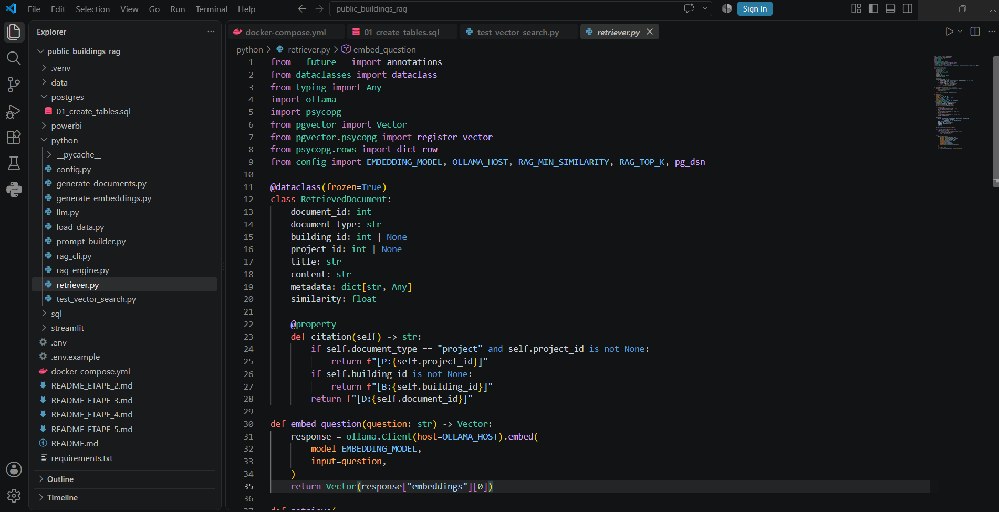
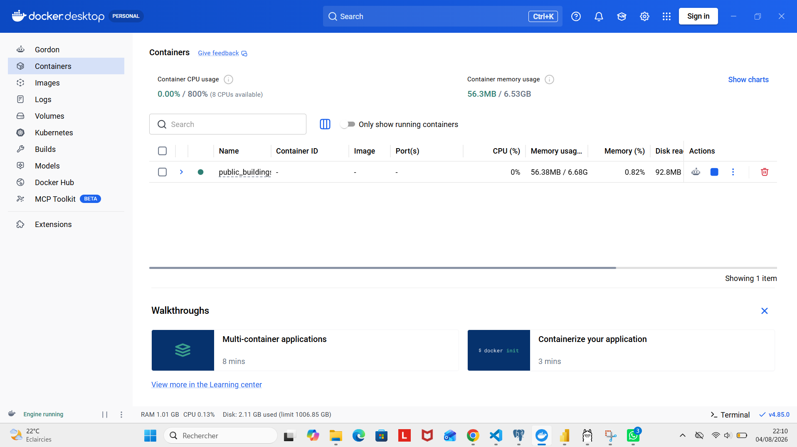

# 🏢 Public Buildings RAG — Assistant IA local avec PostgreSQL & pgvector

## 📌 Présentation

**Public Buildings RAG** est une application RAG (*Retrieval-Augmented Generation*) permettant d'interroger en langage naturel des données relatives à des **bâtiments publics et à leurs projets de rénovation énergétique**.

L'application combine **PostgreSQL, pgvector, Python, Ollama, Llama 3.1 et Streamlit** et fonctionne entièrement en local, sans API LLM payante.

Exemples de questions :

> Quels bâtiments de Lyon semblent les plus énergivores ?

> Quels projets d'isolation ont généré de bonnes économies d'énergie ?

> Quels projets de rénovation sont les plus pertinents par rapport à ma question ?

---

## 🎯 Objectif

L'objectif est de permettre à un utilisateur d'explorer des données métier sans avoir besoin d'écrire lui-même des requêtes SQL.

Le projet combine deux approches complémentaires :

- **SQL** pour l'analyse structurée des données ;
- **recherche vectorielle avec pgvector** pour retrouver des informations selon leur sens et leur similarité sémantique.

Les informations récupérées sont ensuite fournies à **Llama 3.1** afin de générer une réponse en langage naturel.

---

## 🏗️ Architecture

```text
Utilisateur
    │
    ▼
Streamlit
    │
    ▼
Question en langage naturel
    │
    ▼
nomic-embed-text
    │
    ▼
Embedding (vecteur)
    │
    ▼
PostgreSQL + pgvector
    │
    ▼
Documents les plus pertinents
    │
    ▼
Construction du contexte RAG
    │
    ▼
Llama 3.1 via Ollama
    │
    ▼
Réponse
```

Le pipeline fonctionne entièrement sur la machine locale.

---

## 🛠️ Technologies

| Technologie | Rôle |
|---|---|
| **Python** | Traitement des données et orchestration du RAG |
| **PostgreSQL 17** | Stockage des données |
| **pgvector** | Stockage des embeddings et recherche vectorielle |
| **Docker** | Exécution de PostgreSQL + pgvector |
| **Ollama** | Exécution locale des modèles |
| **nomic-embed-text** | Génération des embeddings |
| **Llama 3.1** | Génération des réponses |
| **Streamlit** | Interface utilisateur |

---

## 🧠 Fonctionnement du RAG

Lorsqu'un utilisateur pose une question :

1. la question est transformée en **embedding** avec `nomic-embed-text` ;
2. **pgvector** compare ce vecteur aux documents enregistrés dans PostgreSQL ;
3. les documents les plus similaires sont récupérés ;
4. Python construit un contexte contenant ces informations ;
5. **Llama 3.1** génère une réponse à partir de ce contexte ;
6. la réponse est affichée dans **Streamlit**.

Le projet contient **1 400 documents vectorisés**, avec des embeddings de **768 dimensions**.

---

## 🔎 Recherche vectorielle avec pgvector

Exemple conceptuel :

```sql
SELECT
    document_id,
    title,
    content,
    1 - (embedding <=> query_vector) AS similarity
FROM building_documents
ORDER BY embedding <=> query_vector
LIMIT 8;
```

L'opérateur `<=>` permet ici de comparer les vecteurs selon leur distance cosinus.


---

## 📂 Structure du projet

```text
public_buildings_rag/
│
├── data/
│   ├── buildings.csv
│   └── renovation_projects.csv
│
├── postgres/
│   └── 01_create_tables.sql
│
├── python/
│   ├── config.py
│   ├── load_data.py
│   ├── generate_documents.py
│   ├── generate_embeddings.py
│   ├── retriever.py
│   ├── prompt_builder.py
│   ├── llm.py
│   └── rag_engine.py
│
├── streamlit/
│   └── app.py
│
├── docker-compose.yml
├── requirements.txt
├── .env.example
└── README.md
```

### Fichiers principaux

**`retriever.py`**  
Transforme la question en embedding et interroge pgvector pour récupérer les documents les plus pertinents.

**`rag_engine.py`**  
Orchestre le pipeline RAG complet.

**`prompt_builder.py`**  
Construit le prompt à partir de la question et des documents récupérés.

**`llm.py`**  
Communique avec Llama 3.1 via Ollama.

**`app.py`**  
Contient l'interface Streamlit.



---

## 🐳 Pourquoi Docker ?

pgvector est une extension de PostgreSQL.

Docker permet d'exécuter facilement une instance **PostgreSQL 17 avec pgvector déjà installé**, tout en isolant l'environnement de la base de données.



---

## 🚀 Installation et lancement

### 1. Cloner le projet

```bash
git clone <URL_DU_REPOSITORY>
cd public_buildings_rag
```

### 2. Créer l'environnement Python

Sous Windows :

```powershell
python -m venv .venv
.venv\Scripts\Activate.ps1
pip install -r requirements.txt
```

### 3. Démarrer PostgreSQL + pgvector

```powershell
docker compose up -d
```

### 4. Installer les modèles Ollama

```powershell
ollama pull llama3.1
ollama pull nomic-embed-text
```

### 5. Configurer l'environnement

Créer le fichier `.env` à partir de :

```text
.env.example
```

> ⚠️ Le fichier `.env` contenant les informations locales de connexion ne doit pas être publié sur GitHub.

### 6. Préparer les données

```powershell
python python\load_data.py
python python\generate_documents.py
python python\generate_embeddings.py
```

### 7. Lancer l'application

```powershell
streamlit run streamlit\app.py
```

---

## 💡 Exemple d'utilisation

Question :

> **Quels bâtiments de Lyon semblent énergivores ?**

Une analyse SQL peut classer les bâtiments selon leur consommation énergétique :

```sql
SELECT
    building_name,
    building_type,
    energy_intensity_kwh_m2_year
FROM buildings
WHERE city = 'Lyon'
ORDER BY energy_intensity_kwh_m2_year DESC
LIMIT 10;
```

Le RAG permet d'aller plus loin en utilisant la **similarité sémantique** pour rechercher les informations pertinentes avant de les transmettre au modèle de langage.

---

## 🎯 Compétences mises en œuvre

Ce projet met notamment en pratique :

- architecture **RAG de bout en bout** ;
- **Generative AI et LLM** ;
- embeddings et recherche sémantique ;
- **PostgreSQL + pgvector** ;
- Python et traitement des données ;
- conteneurisation avec Docker ;
- intégration de modèles locaux avec Ollama ;
- développement d'une application avec Streamlit.

---

## 🔮 Améliorations possibles

- recherche hybride **SQL + vectorielle** ;
- comparaison des index **HNSW et IVFFlat** ;
- filtres sur les métadonnées ;
- évaluation automatique de la qualité du RAG ;
- ajout d'un système de reranking ;
- API avec FastAPI ;
- tests unitaires et d'intégration ;
- conteneurisation complète de l'application.

---

## 👤 Auteur

**Eudes KODIA**

Data Scientist | Generative AI | Machine Learning | Data Engineering
